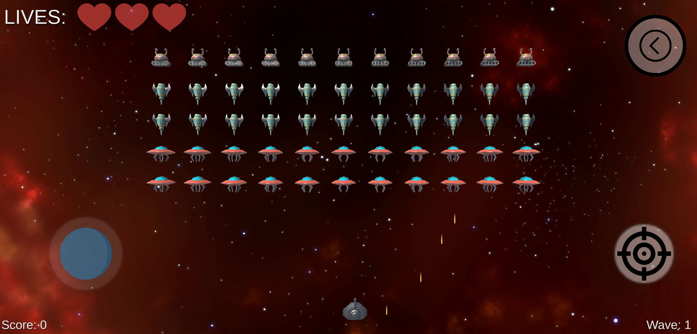

# Space Invaders

The project represents a clone of a well-known game [Space Invaders](https://www.youtube.com/watch?v=D1jZaIPeD5w&ab_channel=316whatupz).

The game starts with a loading screen, in the *main menu*, we can proceed to the *start game* and the *high score* page. The *high score* page contains the 10 last saved highest scores.

In the beginning, the enemies slide towards the middle of the screen and move horizontally. Every time they touch the wall, they move in the opposite direction and down a little bit. The player dies if he loses all his lives. We acquire score points every time we destroy an enemy. The game is an infinite loop and a new wave appears when a player kills all the space ships on the screen. 

## Build

The build is playable on any Android device (with the Internet) and can be downloaded from the main folder. File: **"Space Invaders.apk"**. It uses Amazon S3 Server to hold **AssetBundles**.

If the build does not go further than Loading Screen then probably the AssetBundles disappeared from the server.

## Features

- **Unity.Addressables with AssetBundles** already on server (examples in calsses: *LevelLoader*, *AssignAddressables*, *AddressablesManager*),
- [Amazon S3 Server for Unity.Addressables](https://s3.console.aws.amazon.com/s3/buckets/spaceinvadersbucket?region=eu-central-1&prefix=Android/&showversions=false),
- **Dependency Injection** (examples in classes: *PlayerHealth*, *Enemy* - but there are a lot of them in the project),
- **Obsever Pattern** (examples in classes: *Enemy* - *EnemyWaveMovement*, *CheckEnemy* - *WaveManager*),
- **Singleton Pattern** (uncommonly: *AssignAddressables*),
- **Config files (Scriptable Objects)** (examples in classes: *ShipSettings*, *ProjectileConfig*),
- **Object Pooling** (class: *GameObjectPool*),
- **Serialized saveing system** (class: *SaveSystem*)

## Remarks

While doing this project I had contact with **Unity Addressables** for the first time and probably this is not the best way of implementing it.

## Additional Resources
[Dynamic Space Background Lite](https://assetstore.unity.com/packages/2d/textures-materials/dynamic-space-background-lite-104606#description) by DinV Studio
